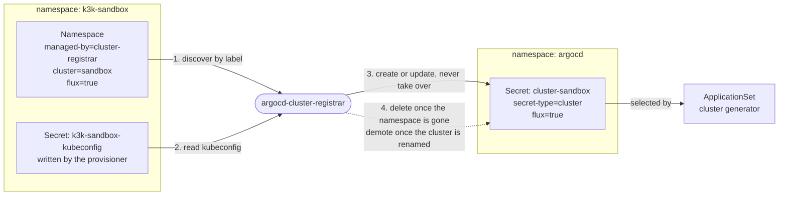
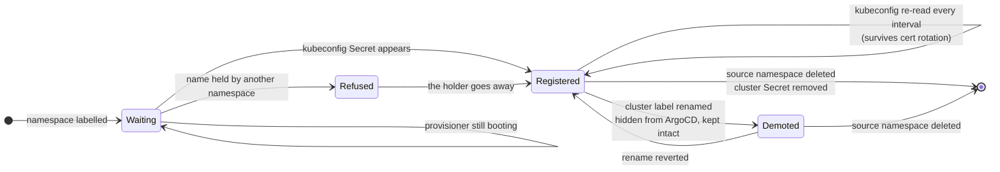

[](https://github.com/pcanilho/argocd-cluster-registrar/actions/workflows/release.yaml)
[](https://github.com/pcanilho/argocd-cluster-registrar/actions/workflows/test.yaml)
[](https://github.com/pcanilho/argocd-cluster-registrar/actions/workflows/dependabot/dependabot-updates)
[](https://github.com/pcanilho/argocd-cluster-registrar/actions/workflows/sast.yaml)

[](https://github.com/pcanilho/argocd-cluster-registrar/releases)
[](go.mod)
[](LICENSE)
<p align="center" width="100%">
    </img>
    <br>
    <i><b>argocd-cluster-registrar</b></i>
    <br>
    A cluster registrar made for ArgoCD
    <br>
    <br>
    ⚙️ <a href="#installing">Installing</a> | 🔎 <a href="#configuring">Configuring</a> | 🧩 <a href="#how-it-works">How it works</a>
    <br>
    <br>
</p>

If you are running clusters inside your cluster with
[k3k](https://github.com/rancher/k3k), [vcluster](https://www.vcluster.com/),
[Kamaji](https://kamaji.clastix.io/) or [Cluster API](https://cluster-api.sigs.k8s.io/),
and you use [ArgoCD](https://argoproj.github.io/argo-cd/), stop reading and jump to
[installing](#installing)!

Why? You have probably noticed that ArgoCD does not detect them out-of-the-box. The
provisioner writes a kubeconfig `Secret` into the cluster's namespace, but ArgoCD only
reads `Secret`s in its own namespace labelled
`argocd.argoproj.io/secret-type: cluster`, so you end up registering clusters by hand,
or with a somewhat painful ad-hoc script.

I have got you covered. This does it for you, and it also does the part scripts
usually skip:

* Registers each child cluster it finds, so ArgoCD can target it by name.
* Deletes the registration when the cluster is gone. Otherwise a destroyed
  cluster leaves a dead entry in ArgoCD forever.
* Re-reads every kubeconfig on each pass. A k3s server restart rotates the
  child's client certificate, and without this ArgoCD quietly starts failing
  authentication.

> [!IMPORTANT]
> Upgrading from `0.1.x` (`vcluster-argocd-exporter`)? The flags, values, Secret
> names and labels all changed, and a stale values file fails silently. See
> [Migrating from 0.1.x](CHANGELOG.md#migrating-from-01x). That section predates
> `providers`; where it tells you to set `secretNamePattern`/`secretKey`, prefer a
> `providers` entry instead.

## Installing

Install it once, as a singleton. Do not add it as a dependency of a per-cluster
chart: every instance reconciles cluster-wide and garbage collects, so two
instances sharing a `managedBy` value fight over the same `Secret`s, each
overwriting the other's work every pass.

### Helm `dependency`

```yaml
dependencies:
  - name: argocd-cluster-registrar
    version: ">=0.2.0"
    repository: oci://ghcr.io/pcanilho/charts
```

### Helm `standalone`

```bash
helm upgrade <release_name> --install \
  oci://ghcr.io/pcanilho/charts/argocd-cluster-registrar \
  -n <namespace> --create-namespace
```

## Configuring

### Values

```yaml
# Namespace ArgoCD reads cluster Secrets from. ArgoCD only looks in its own
# namespace, so in practice this is always "argocd".
targetNamespace: argocd

# Prefix for the labels read off the source namespace and copied onto the cluster
# Secret. Change it to match an existing labelling convention.
labelPrefix: argocd-cluster-registrar/

# Value of the `<labelPrefix>managed-by` label. It picks which namespaces to
# watch, and which cluster Secrets this release owns. Give each instance its own.
managedBy: cluster-registrar

# Provisioners to look for, in precedence order. Presets: k3k, vcluster, kamaji,
# capi. Empty means the binary's own default, which is k3k. See "Providers" below.
providers: []

# Each pass re-reads every kubeconfig, which is what keeps registrations working
# after a certificate rotation.
interval: 60s

# Log what would change without writing anything. Useful the first time you point
# this at an existing cluster, to check the GC selector matches only what you expect.
dryRun: false

# Verbose logging.
debug: false
```

The binary also falls back to your own kubeconfig when it is not running in a
cluster, so you can try it before installing anything:

```bash
argocd-cluster-registrar --once --dry-run --debug
```

### Providers

`providers` lists the provisioner shapes to look for, **in precedence order**.
Each preset is a `Secret`-name glob plus the keys that may hold the kubeconfig:

| Preset | Provisioner | `Secret` name | Key(s) | Status |
|---|---|---|---|---|
| `k3k` | [k3k](https://github.com/rancher/k3k) v1.2.0-rc3 | `k3k-*-kubeconfig` | `kubeconfig.yaml` | tested |
| `vcluster` | [vcluster](https://www.vcluster.com/) 0.36.1 | `vc-*` | `config` | tested, see below |
| `kamaji` | [Kamaji](https://kamaji.clastix.io/) v1.0.0 standalone | `*-admin-kubeconfig` | `admin.conf`, `admin.svc` | tested, see below |
| `capi` | [Cluster API](https://cluster-api.sigs.k8s.io/) v1.13.4 contract | `*-kubeconfig` | `value` | tested, see below |

`Status` is meant literally: **tested** has been run against the real thing.
Nothing currently ships as **assumed**, but the column stays so it can be honest
if that changes.

Several can run at once, which is rather the point. One instance serves a mixed
fleet:

```yaml
providers:
  - k3k
  - capi
```

Anything else that writes a kubeconfig into a `Secret` works too, spelled out in
full:

```yaml
providers:
  - name: mytool
    secretNamePattern: "mytool-*-kubeconfig"
    secretKeys: [kubeconfig]
```

The matched provider is recorded on the cluster `Secret` as
`<labelPrefix>provider`, so an ApplicationSet can select by provisioner.

#### Per-provider notes

**Order matters.** The globs overlap on purpose: `capi`'s `*-kubeconfig` also
matches k3k's `k3k-<cluster>-kubeconfig`. Correctness comes from the key, not the
name, and where two providers could both claim a `Secret` the one declared first
wins. Put the more specific provider first. `capi` is the loosest shipped.

**Scope.** This registers clusters provisioned *inside* the host cluster: something
running here writes a kubeconfig `Secret` into a namespace you can label. A
standalone cluster elsewhere has no such object, so there is nothing to discover.

**Kamaji** normally writes both `admin.conf` and `admin.svc`. Only the first key
present is tried, so `admin.conf` wins; reorder them in a custom entry if you need
the other. Running Kamaji through its Cluster API control-plane provider produces
a second, CAPI-shaped `Secret` for the same cluster, so with both presets enabled
the one declared first decides which is used.

**`capi`** is the mandatory control-plane contract, so it covers any CAPI cluster
whatever the infrastructure provider, plus standalone k0smotron. It does **not**
usefully cover managed cloud control planes: CAPA's EKS path writes an `exec`
credential, which cannot become an ArgoCD `Secret` at all, and the CAPI-internal
one holds a token that rotates every ~15 minutes. Treat it as self-managed only.

**vcluster** exports a kubeconfig pointing at `https://localhost:8443`, which is
fine for a port-forward and useless to ArgoCD. This is the most common reason a
vcluster registration silently does not work. Point it somewhere ArgoCD can reach:

```yaml
controlPlane:
  service:
    spec:
      type: LoadBalancer
exportKubeConfig:
  server: https://<address>
```

If connections then fail x509 verification, the address is not on the API server
certificate; add it:

```yaml
controlPlane:
  proxy:
    extraSANs:
      - <address>
```

### Marking a cluster for registration

Both labels below are required. A namespace carrying `managed-by` but no
`cluster` is skipped with a warning, and the cluster name must be usable as a
Kubernetes object name, since the resulting Secret is called `cluster-<name>`.

Cluster names are unique across the fleet, and a collision resolves by
**incumbency**: whoever holds a registration keeps it, and another namespace
claiming that name is refused and logged. If nobody holds it yet, the **oldest**
claiming namespace wins. A registration is never taken over, so a cluster you
registered by hand, or one belonging to a different registrar, is left alone.

Label the namespace that holds the kubeconfig `Secret`. It reads the namespace
rather than the `Secret` because the provisioner owns that `Secret`. k3k, for
example, gives it an `ownerReference` to the `Cluster`, so it carries none of
your labels and there is nowhere to put them.

```yaml
apiVersion: v1
kind: Namespace
metadata:
  name: k3k-sandbox
  labels:
    argocd-cluster-registrar/managed-by: cluster-registrar   # discovery and GC ownership
    argocd-cluster-registrar/cluster: sandbox                # the ArgoCD cluster name
    argocd-cluster-registrar/flux: "true"                    # extra labels get copied over
```

Any other label under the same prefix is copied onto the cluster `Secret`, which
is how an ApplicationSet cluster generator can select on it:

```yaml
generators:
  - clusters:
      selector:
        matchLabels:
          argocd-cluster-registrar/flux: "true"
```

## How it works



The provisioner writes the kubeconfig. The registrar reshapes its credentials
into ArgoCD's format, copies across any prefixed labels from the namespace, and writes the result into `argocd`.

Each pass is a full reconcile rather than an event diff. It is easier to reason
about, and refreshing credentials comes for free:



Cluster `Secret`s that carry the ownership label but whose source namespace has
gone are deleted. Anything without that label is left alone, so clusters you
registered by hand are safe.

Renaming a cluster is the one other way a registration goes away, and it is not a
deletion. If a namespace's `cluster` label changes, the new name is registered and
the old `Secret` is **demoted**: its `argocd.argoproj.io/secret-type` label is
parked under `<labelPrefix>orphaned-secret-type` and it gains
`<labelPrefix>superseded-by` and `<labelPrefix>stale-since`. ArgoCD finds clusters
by that one label, so the stale entry disappears from ArgoCD immediately while
nothing is destroyed: everything ArgoCD wrote into it, and any annotations you
added, survive. Change the label back and the registration is restored intact, so
a mistaken rename costs nothing. Demoted `Secret`s are still garbage collected
once their source namespace is gone.

### Who is allowed to set these labels

The two labels are **policy input**, not decoration: together they decide whether
a cluster gets registered at all and what name it takes in `argocd`, a namespace
where writing a cluster `Secret` is an administrative act. Treat them as something
the platform operator owns.

Kubernetes helps here by default. The built-in `admin` role, bound into a
namespace with a `RoleBinding`, grants no write access to the `Namespace` object
itself, so an ordinary tenant cannot relabel their own namespace. But **whoever
can create a namespace sets its labels at creation**, so a cluster where teams
self-serve namespaces is a different situation.

Incumbency means a registration cannot be stolen, which is the attack worth
caring about. It does not, and cannot, stop someone who can label a namespace
from registering a cluster of their own under any *free* name. No collision policy
can, because the label is the authorization. If you cannot vouch for who sets
these labels, constrain them where they are written rather than here: a
`ValidatingAdmissionPolicy` binding permitted cluster names to namespace metadata
is the usual answer, and is what Gateway API recommends for the same problem.

### Changing `managedBy` or `labelPrefix` later

Both are part of the ownership record written onto every cluster `Secret`, so
changing either on a running install orphans everything already registered. The
registrar will refuse to adopt those `Secret`s, because refusing to write objects
that record a different owner is exactly the protection above, and garbage
collection will not see them either since it selects on the same label.

Neither value is meant to change, but if you must: delete the old cluster
`Secret`s and let them be recreated, or relabel them by hand to the new values
first. The refusal is logged per cluster, naming the `Secret` and the namespace.

RBAC is split by scope. Reads are cluster-wide (`namespaces` get/list, `secrets`
list) because discovery is label-driven and the sources sit in one namespace per
child. Every **write** is a namespaced `Role` bound to
`targetNamespace` alone, since that is the only place this ever creates, updates
or deletes anything. Granting `secrets` write across the whole cluster would be a
privilege-escalation path in exchange for nothing.
