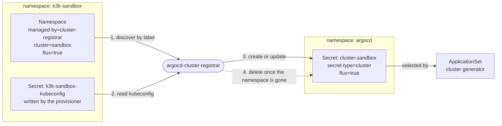
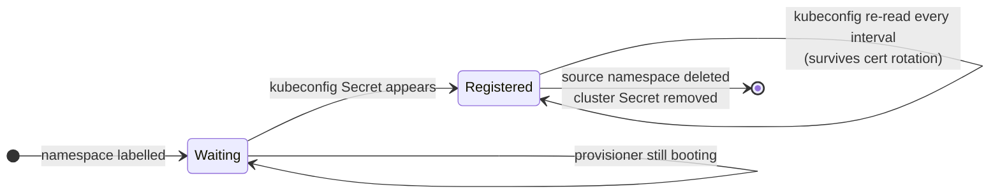

[](https://github.com/pcanilho/argocd-cluster-registrar/actions/workflows/release.yaml)
[](https://github.com/pcanilho/argocd-cluster-registrar/actions/workflows/test.yaml)
[](https://github.com/pcanilho/argocd-cluster-registrar/actions/workflows/dependabot/dependabot-updates)
[](https://github.com/pcanilho/argocd-cluster-registrar/actions/workflows/sast.yaml)

[](https://github.com/pcanilho/argocd-cluster-registrar/releases)
[](go.mod)
[](LICENSE)
<p align="center" width="100%">
    </img>
    <br>
    <i><b>argocd-cluster-registrar</b></i>
    <br>
    A cluster registrar made for ArgoCD
    <br>
    <br>
    ⚙️ <a href="#installing">Installing</a> | 🔎 <a href="#configuring">Configuring</a> | 🧩 <a href="#how-it-works">How it works</a>
    <br>
    <br>
</p>

If you are running clusters inside your cluster with
[k3k](https://github.com/rancher/k3k), [vcluster](https://www.vcluster.com/),
[Kamaji](https://kamaji.clastix.io/) or [Cluster API](https://cluster-api.sigs.k8s.io/),
and you use [ArgoCD](https://argoproj.github.io/argo-cd/), stop reading and jump to
[installing](#installing)!

Why? You have probably noticed that ArgoCD does not detect them out-of-the-box. The
provisioner writes a kubeconfig `Secret` into the cluster's namespace, but ArgoCD only
reads `Secret`s in its own namespace labelled
`argocd.argoproj.io/secret-type: cluster`, so you end up registering clusters by hand,
or with a somewhat painful ad-hoc script.

I have got you covered. This does it for you, and it also does the part scripts
usually skip:

* Registers each child cluster it finds, so ArgoCD can target it by name.
* Deletes the registration when the cluster is gone. Otherwise a destroyed
  cluster leaves a dead entry in ArgoCD forever.
* Re-reads every kubeconfig on each pass. A k3s server restart rotates the
  child's client certificate, and without this ArgoCD quietly starts failing
  authentication.

> [!IMPORTANT]
> Upgrading from `0.1.x` (`vcluster-argocd-exporter`)? The flags, values, Secret
> names and labels all changed, and a stale values file fails silently. See
> [Migrating from 0.1.x](CHANGELOG.md#migrating-from-01x). That section predates
> `providers`; where it tells you to set `secretNamePattern`/`secretKey`, prefer a
> `providers` entry instead.

## Installing

Install it once, as a singleton. Do not add it as a dependency of a per-cluster
chart: every instance reconciles cluster-wide and garbage collects, so two
instances sharing a `managedBy` value fight over the same `Secret`s, each
overwriting the other's work every pass.

### Helm `dependency`

```yaml
dependencies:
  - name: argocd-cluster-registrar
    version: ">=0.2.0"
    repository: oci://ghcr.io/pcanilho/charts
```

### Helm `standalone`

```bash
helm upgrade <release_name> --install \
  oci://ghcr.io/pcanilho/charts/argocd-cluster-registrar \
  -n <namespace> --create-namespace
```

## Configuring

### Values

```yaml
# Namespace ArgoCD reads cluster Secrets from. ArgoCD only looks in its own
# namespace, so in practice this is always "argocd".
targetNamespace: argocd

# Prefix for the labels read off the source namespace and copied onto the cluster
# Secret. Change it to match an existing labelling convention.
labelPrefix: argocd-cluster-registrar/

# Value of the `<labelPrefix>managed-by` label. It picks which namespaces to
# watch, and which cluster Secrets this release owns. Give each instance its own.
managedBy: cluster-registrar

# Provisioners to look for, in precedence order. Presets: k3k, vcluster, kamaji,
# capi. Empty means the binary's own default, which is k3k. See "Providers" below.
providers: []

# Each pass re-reads every kubeconfig, which is what keeps registrations working
# after a certificate rotation.
interval: 60s

# Log what would change without writing anything. Useful the first time you point
# this at an existing cluster, to check the GC selector matches only what you expect.
dryRun: false

# Verbose logging.
debug: false
```

The binary also falls back to your own kubeconfig when it is not running in a
cluster, so you can try it before installing anything:

```bash
argocd-cluster-registrar --once --dry-run --debug
```

### Providers

`providers` lists the provisioner shapes to look for, **in precedence order**.
Each preset is a `Secret`-name glob plus the keys that may hold the kubeconfig:

| Preset | Provisioner | `Secret` name | Key(s) | Status |
|---|---|---|---|---|
| `k3k` | [k3k](https://github.com/rancher/k3k) v1.2.0-rc3 | `k3k-*-kubeconfig` | `kubeconfig.yaml` | tested |
| `vcluster` | [vcluster](https://www.vcluster.com/) 0.36.1 | `vc-*` | `config` | tested, see below |
| `kamaji` | [Kamaji](https://kamaji.clastix.io/) v1.0.0 standalone | `*-admin-kubeconfig` | `admin.conf`, `admin.svc` | tested, see below |
| `capi` | [Cluster API](https://cluster-api.sigs.k8s.io/) contract | `*-kubeconfig` | `value` | assumed |

`Status` is meant literally: **tested** has been run against the real thing,
**assumed** was taken from upstream source but not exercised here.

Several can run at once, which is rather the point. One instance serves a mixed
fleet:

```yaml
providers:
  - k3k
  - capi
```

Anything else that writes a kubeconfig into a `Secret` works too, spelled out in
full:

```yaml
providers:
  - name: mytool
    secretNamePattern: "mytool-*-kubeconfig"
    secretKeys: [kubeconfig]
```

The matched provider is recorded on the cluster `Secret` as
`<labelPrefix>provider`, so an ApplicationSet can select by provisioner.

#### Scope

This registers clusters **provisioned inside the host cluster**: something running
here writes a kubeconfig `Secret` into a namespace you can label, and that `Secret`
is the only input. A standalone cluster elsewhere has no such object, so there is
nothing to discover. That is a different problem, usually one of reachability.

#### Why order matters

The globs overlap deliberately. `capi`'s `*-kubeconfig` also matches k3k's
`k3k-<cluster>-kubeconfig`. Correctness comes from the **key**, not the name: the
k3k `Secret` carries no `value`, so `capi` falls through. Where two providers could
both claim a `Secret`, the one declared first wins, and a `Secret` already claimed
is never offered twice, so one cluster is registered once.

That is not hypothetical. Driving Kamaji through its Cluster API control-plane
provider produces **two** `Secret`s for one cluster: Kamaji's own
`<tcp>-admin-kubeconfig`, and a CAPI-shaped `<cluster>-kubeconfig` copied from it.
With both presets enabled, both match.

#### Kamaji

Tested against Kamaji v1.0.0: a `TenantControlPlane` named `tenant-00` produced
`tenant-00-admin-kubeconfig`, and the resulting registration authenticated to the
tenant API server with `insecure: false` and full x509 verification.

Two things worth knowing. The `Secret` also carries `super-admin.conf` and
`super-admin.svc`; the preset tries `admin.conf` first, so the ordinary admin
credential wins and the more privileged one is never copied. And Kamaji writes
sibling `<tcp>-controller-manager-kubeconfig` and `<tcp>-scheduler-kubeconfig`
`Secret`s, which do **not** end in `-admin-kubeconfig` and so never match the
`kamaji` preset. They do match `capi`'s looser `*-kubeconfig`, but carry no
`value` key, so they are rejected there too.

`admin.conf` points at the control plane's `Service` address. When
`spec.networkProfile.address` advertises a different one, Kamaji writes it to
`admin.svc` as well, hence two keys. Both are normally present at once: a live
v1.0.0 `TenantControlPlane` carried `admin.conf`, `admin.svc`, `super-admin.conf`
and `super-admin.svc` on the same `Secret`.

Whichever key is present first in the list wins, and only that one is tried. If
`admin.conf` is unusable, `admin.svc` is not attempted as a fallback; reorder them
in a custom provider entry if you need the other.

#### About `capi`

It is the *mandatory* Cluster API control-plane contract rather than a convention:
`<cluster>-kubeconfig` in the Cluster's namespace, type `cluster.x-k8s.io/secret`,
kubeconfig under `value`. One entry therefore covers any CAPI cluster whatever the
**infrastructure** provider. Note that the kubeconfig is written by the
*control-plane* provider (KCP, KamajiControlPlane, K0sControlPlane,
KThreesControlPlane, Talos CACPPT), not by CAPD, Proxmox or Metal3. Standalone
k0smotron adopts the same shape, so it is covered as well.
[CAPI + KubeVirt](https://github.com/kubernetes-sigs/cluster-api-provider-kubevirt)
is the closest peer to k3k and vcluster: child clusters as VMs inside the host
cluster.

It does **not** usefully cover managed cloud control planes. CAPA's EKS path writes
a second `<cluster>-user-kubeconfig` holding an `exec` credential, which cannot be
copied into an ArgoCD `Secret` at all, and the CAPI-internal one holds a token that
rotates every ~15 minutes. A candidate that fails to parse is skipped in favour of
the next, so the `exec` case degrades safely. A short-lived token is worse: it
parses, registers, and then quietly expires. So
treat `capi` as self-managed control planes only.

`capi` is also the loosest pattern shipped: `*-kubeconfig` matches anything in a
managed namespace ending that way. Put a more specific provider first.

#### vcluster

vcluster exports a kubeconfig pointing at `https://localhost:8443`, which is fine
for a port-forward and useless to ArgoCD. Set `exportKubeConfig.server` to an
address ArgoCD can reach, and expose the control plane on it:

```yaml
controlPlane:
  service:
    spec:
      type: LoadBalancer
exportKubeConfig:
  server: https://<address>
```

That was enough when this was tested against vcluster 0.36.1 with a LoadBalancer
address: ArgoCD connected with `insecure: false` and verification passed, so the
address was already covered by the API server certificate. If yours is not, and
connections fail x509 verification, add it to the certificate explicitly:

```yaml
controlPlane:
  proxy:
    extraSANs:
      - <address>
```

Note that `vc-*` also matches vcluster's own `vc-config-<name>` `Secret`, which
holds no kubeconfig (its key is `config.yaml`, not `config`). That is handled: a
`Secret` is only used if it matches the name pattern *and* carries one of the
provider's keys. Do not rely on ordering to save you here: whether the decoy sorts
first depends entirely on the names. `vc-config-x` sorts before `vc-x`, but
`vc-config-abc` sorts *after* `vc-abc`. The key check is what saves you, not the sort.

### Marking a cluster for registration

Both labels below are required. A namespace carrying `managed-by` but no
`cluster` is skipped with a warning, and the cluster name must be usable as a
Kubernetes object name, since the resulting Secret is called `cluster-<name>`.
Two namespaces must never claim the same cluster name.

Label the namespace that holds the kubeconfig `Secret`. It reads the namespace
rather than the `Secret` because the provisioner owns that `Secret`. k3k, for
example, gives it an `ownerReference` to the `Cluster`, so it carries none of
your labels and there is nowhere to put them.

```yaml
apiVersion: v1
kind: Namespace
metadata:
  name: k3k-sandbox
  labels:
    argocd-cluster-registrar/managed-by: cluster-registrar   # discovery and GC ownership
    argocd-cluster-registrar/cluster: sandbox                # the ArgoCD cluster name
    argocd-cluster-registrar/flux: "true"                    # extra labels get copied over
```

Any other label under the same prefix is copied onto the cluster `Secret`, which
is how an ApplicationSet cluster generator can select on it:

```yaml
generators:
  - clusters:
      selector:
        matchLabels:
          argocd-cluster-registrar/flux: "true"
```

## How it works



The provisioner writes the kubeconfig. The registrar reshapes its credentials
into ArgoCD's format, copies across any prefixed labels from the namespace, and writes the result into `argocd`.

Each pass is a full reconcile rather than an event diff. It is easier to reason
about, and refreshing credentials comes for free:



Cluster `Secret`s that carry the ownership label but whose source namespace has
gone are deleted. Anything without that label is left alone, so clusters you
registered by hand are safe.

RBAC is split by scope. Reads are cluster-wide (`namespaces` get/list, `secrets`
list) because discovery is label-driven and the sources sit in one namespace per
child. Every **write** is a namespaced `Role` bound to
`targetNamespace` alone, since that is the only place this ever creates, updates
or deletes anything. Granting `secrets` write across the whole cluster would be a
privilege-escalation path in exchange for nothing.
