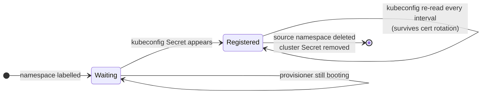

[](https://github.com/pcanilho/argocd-cluster-registrar/actions/workflows/release.yaml)
[](https://github.com/pcanilho/argocd-cluster-registrar/actions/workflows/test.yaml)
[](https://github.com/pcanilho/argocd-cluster-registrar/actions/workflows/dependabot/dependabot-updates)
[](https://github.com/pcanilho/argocd-cluster-registrar/actions/workflows/sast.yaml)


<p align="center" width="100%">
    </img>
    <br>
    <i><b>argocd-cluster-registrar</b></i>
    <br>
    Registers <a href="https://github.com/rancher/k3k">k3k</a> and <a href="https://www.vcluster.com/">vcluster</a> child clusters with ArgoCD, and removes them again when they are deleted
    <br>
    <br>
    ⚙️ <a href="#installing">Installing</a> | 🔎 <a href="#configuring">Configuring</a> | 🧩 <a href="#how-it-works">How it works</a>
    <br>
    <br>
</p>

You spin up a cluster inside your cluster with [k3k](https://github.com/rancher/k3k)
or [vcluster](https://www.vcluster.com/), and ArgoCD cannot see it. The provisioner
writes a kubeconfig `Secret` into the cluster's namespace, but ArgoCD only reads
`Secret`s in its own namespace labelled `argocd.argoproj.io/secret-type: cluster`.
So you end up registering clusters by hand, or with a script.

This does it for you, and it also does the part scripts usually skip:

* Registers each child cluster it finds, so ArgoCD can target it by name.
* Deletes the registration when the cluster is gone. Otherwise a destroyed
  cluster leaves a dead entry in ArgoCD forever.
* Re-reads every kubeconfig on each pass. A k3s server restart rotates the
  child's client certificate, and without this ArgoCD quietly starts failing
  authentication.

> [!IMPORTANT]
> Upgrading from `0.1.x` (`vcluster-argocd-exporter`)? The flags, values, Secret
> names and labels all changed, and a stale values file fails silently. See
> [Migrating from 0.1.x](CHANGELOG.md#migrating-from-01x).

## Installing

Install it once, as a singleton. Do not add it as a dependency of a per-cluster
chart: every instance reconciles cluster-wide and garbage collects, so two
instances sharing a `managedBy` value will delete each other's `Secret`s.

### Helm `dependency`

```yaml
dependencies:
  - name: argocd-cluster-registrar
    version: ">=0.2.0"
    repository: oci://ghcr.io/pcanilho/charts
```

### Helm `standalone`

```bash
helm upgrade <release_name> --install \
  oci://ghcr.io/pcanilho/charts/argocd-cluster-registrar \
  -n <namespace> --create-namespace
```

## Configuring

### Values

```yaml
# Namespace ArgoCD reads cluster Secrets from. ArgoCD only looks in its own
# namespace, so in practice this is always "argocd".
targetNamespace: argocd

# Prefix for the labels read off the source namespace and copied onto the cluster
# Secret. Change it to match an existing labelling convention.
labelPrefix: argocd-cluster-registrar/

# Value of the `<labelPrefix>managed-by` label. It picks which namespaces to
# watch, and which cluster Secrets this release owns. Give each instance its own.
managedBy: cluster-registrar

# Glob matching the kubeconfig Secret in a watched namespace, and the key inside
# it. The defaults suit k3k.
secretNamePattern: "k3k-*-kubeconfig"
secretKey: kubeconfig.yaml

# Each pass re-reads every kubeconfig, which is what keeps registrations working
# after a certificate rotation.
interval: 60s

# Log what would change without writing anything. Useful the first time you point
# this at an existing cluster, to check the GC selector matches only what you expect.
dryRun: false

# Verbose logging.
debug: false
```

The binary also falls back to your own kubeconfig when it is not running in a
cluster, so you can try it before installing anything:

```bash
argocd-cluster-registrar --once --dry-run --debug
```

### Settings per provisioner

| Provisioner | `secretNamePattern` | `secretKey` | Status |
|---|---|---|---|
| [k3k](https://github.com/rancher/k3k) v1.2.0-rc3 | `k3k-*-kubeconfig` | `kubeconfig.yaml` | tested |
| [vcluster](https://www.vcluster.com/) 0.36.1 | `vc-*` | `config` | tested, see below |

Anything else that writes a kubeconfig into a `Secret` should work by setting
those two values, but only the two above have actually been run.

#### vcluster

vcluster exports a kubeconfig pointing at `https://localhost:8443`, which is fine
for a port-forward and useless to ArgoCD. Set `exportKubeConfig.server` to an
address ArgoCD can reach, and expose the control plane on it:

```yaml
controlPlane:
  service:
    spec:
      type: LoadBalancer
exportKubeConfig:
  server: https://<address>
```

That was enough when this was tested against vcluster 0.36.1 with a LoadBalancer
address: ArgoCD connected with `insecure: false` and verification passed, so the
address was already covered by the API server certificate. If yours is not, and
connections fail x509 verification, add it to the certificate explicitly:

```yaml
controlPlane:
  proxy:
    extraSANs:
      - <address>
```

Note that `vc-*` also matches vcluster's own `vc-config-<name>` `Secret`, which
holds no kubeconfig. That is handled: a `Secret` is only used if it matches the
name pattern *and* carries `secretKey`. Do not rely on ordering to save you here
(`vc-config-abc` sorts before `vc-abc`, but after `vc-xyz`).

### Marking a cluster for registration

Both labels below are required. A namespace carrying `managed-by` but no
`cluster` is skipped with a warning, and the cluster name must be usable as a
Kubernetes object name, since the resulting Secret is called `cluster-<name>`.
Two namespaces must never claim the same cluster name.

Label the namespace that holds the kubeconfig `Secret`. It reads the namespace
rather than the `Secret` because the provisioner owns that `Secret`. k3k, for
example, gives it an `ownerReference` to the `Cluster`, so it carries none of
your labels and there is nowhere to put them.

```yaml
apiVersion: v1
kind: Namespace
metadata:
  name: k3k-sandbox
  labels:
    argocd-cluster-registrar/managed-by: cluster-registrar   # discovery and GC ownership
    argocd-cluster-registrar/cluster: sandbox                # the ArgoCD cluster name
    argocd-cluster-registrar/flux: "true"                    # extra labels get copied over
```

Any other label under the same prefix is copied onto the cluster `Secret`, which
is how an ApplicationSet cluster generator can select on it:

```yaml
generators:
  - clusters:
      selector:
        matchLabels:
          argocd-cluster-registrar/flux: "true"
```

## How it works


The provisioner writes the kubeconfig. The registrar reshapes its credentials
into ArgoCD's format, copies across any prefixed labels from the namespace, and writes the result into `argocd`.

Each pass is a full reconcile rather than an event diff. It is easier to reason
about, and refreshing credentials comes for free:



Cluster `Secret`s that carry the ownership label but whose source namespace has
gone are deleted. Anything without that label is left alone, so clusters you
registered by hand are safe.

RBAC is `namespaces` (read) and `secrets` (read, write, delete). It is
cluster-scoped because the sources sit in one namespace per child while the
destination sits in `argocd`.
