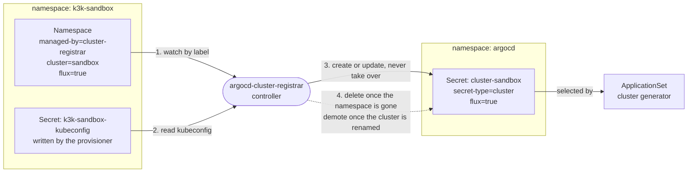

[](https://github.com/pcanilho/argocd-cluster-registrar/actions/workflows/release.yaml)
[](https://github.com/pcanilho/argocd-cluster-registrar/actions/workflows/test.yaml)
[](https://github.com/pcanilho/argocd-cluster-registrar/actions/workflows/dependabot/dependabot-updates)
[](https://github.com/pcanilho/argocd-cluster-registrar/actions/workflows/sast.yaml)

[](https://github.com/pcanilho/argocd-cluster-registrar/releases)
[](go.mod)
[](LICENSE)
<p align="center" width="100%">
    </img>
    <br>
    <i><b>argocd-cluster-registrar</b></i>
    <br>
    A cluster registrar made for ArgoCD
    <br>
    <br>
    ⚙️ <a href="#installing">Installing</a> | 🔎 <a href="#configuring">Configuring</a> | 🧩 <a href="#how-it-works">How it works</a> | 🔐 <a href="#operating">Operating</a>
    <br>
    <br>
</p>

If you are running clusters inside your cluster with
[k3k](https://github.com/rancher/k3k), [vcluster](https://www.vcluster.com/),
[Kamaji](https://kamaji.clastix.io/) or [Cluster API](https://cluster-api.sigs.k8s.io/),
and you use [ArgoCD](https://argoproj.github.io/argo-cd/), stop reading and jump to
[installing](#installing)!

Why? You have probably noticed that ArgoCD does not detect them out-of-the-box. The
provisioner writes a kubeconfig `Secret` into the cluster's namespace, but ArgoCD only
reads `Secret`s in its own namespace labelled
`argocd.argoproj.io/secret-type: cluster`, so you end up registering clusters by hand,
or with a somewhat painful ad-hoc script.

I have got you covered. This does it for you, and it also does the part scripts
usually skip:

* Registers each child cluster it finds, so ArgoCD can target it by name.
* Deletes the registration when the cluster is gone. Otherwise a destroyed
  cluster leaves a dead entry in ArgoCD forever.
* Re-reads every kubeconfig on a timer, on top of reacting to changes. A k3s
  server restart rotates the child's client certificate, and without this ArgoCD
  quietly starts failing authentication.

> [!IMPORTANT]
> Upgrading from `0.3.x`? Nothing to change, but registration is event-driven now
> and the RBAC widens. See
> [Migrating from 0.3.x](CHANGELOG.md#migrating-from-03x).
>
> Upgrading from `0.1.x` (`vcluster-argocd-exporter`)? The flags, values, Secret
> names and labels all changed, and a stale values file fails silently. See
> [Migrating from 0.1.x](CHANGELOG.md#migrating-from-01x). That section predates
> `providers`; where it tells you to set `secretNamePattern`/`secretKey`, prefer a
> `providers` entry instead.

## Installing

Install it once, as a singleton. Do not add it as a dependency of a per-cluster
chart: every instance reconciles cluster-wide, so a second one is at best doing
the same work twice. Give each instance its own `managedBy` if you do run more
than one. Two instances sharing that value but configured with different
`providers` will rewrite each other's `<labelPrefix>provider` label on every
reconcile, forever. Setting `leaderElection.enabled` makes that safe instead:
whichever acquires the lease runs, and the other waits.

### Helm `dependency`

```yaml
dependencies:
  - name: argocd-cluster-registrar
    version: ">=0.2.0"
    repository: oci://ghcr.io/pcanilho/charts
```

### Helm `standalone`

```bash
helm upgrade <release_name> --install \
  oci://ghcr.io/pcanilho/charts/argocd-cluster-registrar \
  -n <namespace> --create-namespace
```

### Verifying the image

Images are signed keyless with cosign, through GitHub Actions OIDC.

```bash
cosign verify ghcr.io/pcanilho/argocd-cluster-registrar:<tag> \
  --certificate-identity-regexp '^https://github\.com/pcanilho/argocd-cluster-registrar/' \
  --certificate-oidc-issuer https://token.actions.githubusercontent.com
```

**From 0.6.0 this needs cosign v3.** Releases up to 0.5.0 were signed with cosign
v2, which writes the signature to a `.sig` tag; 0.6.0 onwards uses cosign v3,
whose default is the protobuf bundle stored as an OCI 1.1 referring artifact. A
cosign v2 client will not find a 0.6.0 signature and will report the image as
unsigned rather than as failing verification, so check your client version before
concluding anything.

## Configuring

### Values

Everything is optional. A default install registers k3k clusters into `argocd`:

```yaml
# Provisioners to look for, in precedence order. Presets: k3k, vcluster, kamaji,
# capi, capa-eks, capz-aks. Unset means k3k. See "Providers" below.
providers:
  - k3k
  - capi

# Namespace ArgoCD reads cluster Secrets from.
targetNamespace: argocd

# Picks which namespaces to watch and which cluster Secrets this release owns.
# Give each instance its own.
managedBy: cluster-registrar
```

Every key is documented in the chart itself, which is the copy that cannot drift
from the code:

```bash
helm show values oci://ghcr.io/pcanilho/charts/argocd-cluster-registrar
```

The ones worth knowing about are `interval`, `demotedTTL`, `leaderElection`,
`probes` and `metrics`; see [Operating](#operating). You can also try it against
a live cluster before installing anything, with
[`--once`](#running-it-without-installing-anything).

### Providers

This registers clusters provisioned *inside* the host cluster: something running
here writes a kubeconfig `Secret` into a namespace you can label. A standalone
cluster elsewhere has no such object, so there is nothing to discover.

`providers` lists the provisioner shapes to look for, **in precedence order**.
Each preset is a `Secret`-name glob plus the keys that may hold the kubeconfig.
`Status` is meant literally: **tested** means run against the version shown.

| Preset | Provisioner | `Secret` name | Key(s) | Status |
|---|---|---|---|---|
| `k3k` | [k3k](https://github.com/rancher/k3k) v1.2.0-rc3 | `k3k-*-kubeconfig` | `kubeconfig.yaml` | tested |
| `vcluster` | [vcluster](https://www.vcluster.com/) 0.36.1 | `vc-*` | `config` | tested, see below |
| `kamaji` | [Kamaji](https://kamaji.clastix.io/) v1.0.0 standalone | `*-admin-kubeconfig` | `admin.conf`, `admin.svc` | tested, see below |
| `capi` | [Cluster API](https://cluster-api.sigs.k8s.io/) v1.13.4 contract | `*-kubeconfig` | `value` | tested, see below |
| `capa-eks` | [CAPA](https://cluster-api-aws.sigs.k8s.io/) managed EKS | `*-user-kubeconfig` | `value` | assumed, see below |
| `capz-aks` | [CAPZ](https://capz.sigs.k8s.io/) managed AKS | `*-kubeconfig-user` | `value` | assumed, see below |

`capa-eks` and `capz-aks` ship as **assumed**: the kubeconfig shapes are taken
from CAPA's and CAPZ's own generators and the translation is unit-tested against
them, but neither has been run against a real EKS or AKS cluster. Note the suffix
order differs between the two, which is CAPZ's spelling rather than a typo here.

Several can run at once, which is rather the point. One instance serves a mixed
fleet:

```yaml
providers:
  - k3k
  - capi
```

Anything else that writes a kubeconfig into a `Secret` works too, spelled out in
full:

```yaml
providers:
  - name: mytool
    secretNamePattern: "mytool-*-kubeconfig"
    secretKeys: [kubeconfig]
    # Optional, and only meaningful with execCredentials: true. Set it on a
    # shape that is exec-bearing by construction, as capa-eks and capz-aks are.
    allowExec: false
```

The matched provider is recorded on the cluster `Secret` as
`<labelPrefix>provider`, so an ApplicationSet can select by provisioner.

#### Per-provider notes

**Order matters,** for providers and for keys. The globs overlap on purpose:
`capi`'s `*-kubeconfig` also matches k3k's `k3k-<cluster>-kubeconfig`. Correctness
comes from the key, not the name, and where two providers could both claim a
`Secret` the one declared first wins. Put the more specific provider first. `capi`
is the loosest shipped. Within one `Secret`, every declared key that is present is
tried in turn and the first that parses wins, so an unusable key falls through to
the next instead of stranding the namespace.

Within one provider, candidates are ordered by **provenance** before name: a
`Secret` whose type matches the one the provisioner stamps scores highest, then
one carrying a controller `ownerReference`, then name order as before. Only
`capi`, `capa-eks` and `capz-aks` match on type, and neither signal is beyond a
tenant who can write `Secret`s in the namespace, so treat this as tie-breaking
rather than as a security control. It does mean that where a namespace holds
several matching `Secret`s, which one wins can differ from 0.5.x.

With `execCredentials` on, passing over a `Secret` that does carry an exec block
in favour of one that cannot is logged at Warn, naming what was skipped. That is
almost always a `providers` list with the generic entry declared first.

**Kamaji** normally writes both `admin.conf` and `admin.svc`, and both normally
parse, so `admin.conf` wins on order and `admin.svc` is reached only when the
first is unusable. Declare `admin.svc` first in a custom entry to prefer the
service address. Running Kamaji through its Cluster API control-plane provider
produces a second, CAPI-shaped `Secret` for the same cluster, so with both presets
enabled the one declared first decides which is used.

**`capi`** is the mandatory control-plane contract, so it covers any CAPI cluster
whatever the infrastructure provider, plus standalone k0smotron.

**Managed cloud control planes** need `capa-eks` or `capz-aks` as well, plus
`execCredentials: true`. CAPA and CAPZ each write two `Secret`s: the
CAPI-contract one holds a token good for about 15 minutes, and a second holds an
`exec` credential. `capi` matches the first, so on its own you get a registration
that survives only because it is re-read every `interval`; raise the interval
past 15 minutes and it silently breaks.

The exec one is translated into ArgoCD's own `awsAuthConfig` or
`execProviderConfig`, which has no such clock, because ArgoCD mints the
credential per connection. **Declare the managed preset first.** For `capa-eks`
this is load-bearing rather than a preference: `capi`'s `*-kubeconfig` glob also
matches `<cluster>-user-kubeconfig`, so declaring `capi` first claims *both* of
CAPA's Secrets and the exec-bearing one never becomes a candidate at all. That
case is logged at Warn. `capz-aks` uses `*-kubeconfig-user`, which `capi` does
not match, so there only precedence is at stake.

```yaml
execCredentials: true
providers:
  - capa-eks   # must come before capi
  - capi
```

> [!IMPORTANT]
> A translated registration makes ArgoCD authenticate **as itself**, with its own
> IRSA or workload identity, not with a credential from the source namespace.
> Access is governed by EKS access entries or AKS RBAC against ArgoCD's
> principal, which this tool neither sees nor revokes when the namespace goes
> away. Both `execCredentials` and the provider's opt-in must be set, and both are
> off by default, for that reason.
>
> Caller identity is discarded. `kubelogin`'s `--client-id`, `--tenant-id` and
> `--login` are dropped and the registration proceeds; on the AWS paths anything
> outside the allowlist, `--profile` and `--role` included, is **refused
> outright**, because silently dropping an `--external-id` would turn a working
> `AssumeRole` into an unexplained `AccessDenied`.
>
> The *target*, though, comes from the tenant: the EKS cluster name, the AAD
> server application and the `server` address are all read off the source Secret,
> so whoever can write it decides which cluster ArgoCD mints a credential for and
> where it is sent. Scope ArgoCD's principal to the clusters it should reach.
>
> Commands other than `aws-iam-authenticator`, `heptio-authenticator-aws`,
> `aws eks get-token` and `kubelogin` are refused rather than guessed at. GKE is
> not translated: `argocd-k8s-auth gcp` returns a token bound to no cluster and no
> audience.

Because ArgoCD authenticates as itself, the rest is configuration on ArgoCD that
this tool cannot do for you. Nothing below is optional, and a registration will
sit `Unknown` until it is in place.

**EKS.** Give `argocd-application-controller` and `argocd-server` an IRSA or Pod
Identity role, trusted by the management cluster's OIDC provider. Then authorize
that role on every child cluster, either as an EKS access entry or an `aws-auth`
mapping. Role assumption is deliberately not forwarded: ArgoCD's `awsAuthConfig`
does have `roleARN` and `profile` fields, but this tool emits neither, because a
role named by the source kubeconfig would let a namespace choose which role
ArgoCD assumes. Authorize the ArgoCD principal on each cluster directly.

Region handling depends on the source kubeconfig, and it is worth knowing which
shape you get. With no `--region` in the exec block -- which is what CAPA writes
-- an `awsAuthConfig` is emitted and `argocd-k8s-auth aws` resolves the region
from the ArgoCD pod's own environment, so that environment must supply one. With
a `--region`, an `execProviderConfig` carrying `AWS_REGION` is emitted instead and
the pod environment is not consulted. Whether one region's STS endpoint is
accepted for a cluster in another has not been verified here, so if you span
regions, set `--region` per cluster in the source kubeconfig rather than relying
on a single ambient value.

**AKS.** Label the ArgoCD pods `azure.workload.identity/use: "true"`, set
`AZURE_CLIENT_ID`, `AZURE_TENANT_ID` and `AZURE_FEDERATED_TOKEN_FILE`, and create
a federated credential per ArgoCD ServiceAccount. Grant the app registration
*Azure Kubernetes Service Cluster User Role* on each cluster plus a
`ClusterRoleBinding` inside it for the object ID. `argocd-k8s-auth azure` defaults
to workload identity on current ArgoCD; older builds fall back to `devicecode`,
which cannot work in a pod, so check yours before relying on this.

Both preset shapes are **assumed**, not tested: the translation is unit-tested
against the kubeconfigs CAPA and CAPZ generate, but no registration produced this
way has been run against a real EKS or AKS cluster. What is unverified is the
runtime -- whether the emitted config authenticates from a real ArgoCD pod -- not
the shapes. Pilot one cluster before the fleet.

**vcluster** exports a kubeconfig pointing at `https://localhost:8443`, which is
fine for a port-forward and useless to ArgoCD. This is the most common reason a
vcluster registration silently does not work. Point it somewhere ArgoCD can reach:

```yaml
controlPlane:
  service:
    spec:
      type: LoadBalancer
exportKubeConfig:
  server: https://<address>
```

If connections then fail x509 verification, the address is not on the API server
certificate; add it:

```yaml
controlPlane:
  proxy:
    extraSANs:
      - <address>
```

**Not preset, and experimental.**
[HyperShift](https://hypershift-docs.netlify.app/) hosted control planes and
[Kubermatic KKP](https://docs.kubermatic.com/) user clusters work as a custom entry:

```yaml
providers:
  - name: kubermatic
    secretNamePattern: "admin-kubeconfig"
    secretKeys: [kubeconfig]
  - name: hypershift
    secretNamePattern: "*-admin-kubeconfig"
    secretKeys: [kubeconfig]
```

**Declare them in that order** if you run both: `*-admin-kubeconfig` also matches
KKP's `internal-admin-kubeconfig`, which is reachable only from inside the cluster.
Against `kamaji` the order is free, since that preset's keys are disjoint from
these.

**Gardener** is out of scope for the same reason as managed cloud control planes:
since Kubernetes 1.27 it issues short-lived client certificates through the
`shoots/adminkubeconfig` subresource instead of writing a static `Secret`.

### Marking a cluster for registration

Both labels below are required. A namespace carrying `managed-by` but no
`cluster` is skipped with a warning, and the cluster name must be usable as a
Kubernetes object name, since the resulting Secret is called `cluster-<name>`.

Cluster names are unique across the fleet, and a collision resolves by
**incumbency**: whoever holds a registration keeps it, and another namespace
claiming that name is refused and logged. If nobody holds it yet, the **oldest**
claiming namespace wins. A registration is never taken over, so a cluster you
registered by hand, or one belonging to a different registrar, is left alone.

Label the namespace that holds the kubeconfig `Secret`. It reads the namespace
rather than the `Secret` because the provisioner owns that `Secret`. k3k, for
example, gives it an `ownerReference` to the `Cluster`, so it carries none of
your labels and there is nowhere to put them.

```yaml
apiVersion: v1
kind: Namespace
metadata:
  name: k3k-sandbox
  labels:
    argocd-cluster-registrar/managed-by: cluster-registrar   # ownership
    argocd-cluster-registrar/cluster: sandbox                # the ArgoCD cluster name
    argocd-cluster-registrar/flux: "true"                    # copied to the Secret
```

Any label under the same prefix is copied onto the cluster `Secret`, except the
handful this tool writes itself (`managed-by`, `cluster`, `source-namespace`,
`source-namespace-uid`, `provider`, and the demotion and prune markers below).
Copying is how an ApplicationSet cluster generator selects on them:

```yaml
generators:
  - clusters:
      selector:
        matchLabels:
          argocd-cluster-registrar/flux: "true"
```

Prefixed **annotations** are copied the same way, with the same exclusions. The
cluster generator exposes them as `{{metadata.annotations.<key>}}`, so they reach
a template exactly as labels do. Use them for anything a label value cannot hold:
a URL, a comma-separated list, anything over 63 bytes or containing `/` or `:`.
Values over 4KiB are skipped and logged, as is anything past 32KiB in total or 32
keys; nothing is truncated. Note the generator's `selector` matches
labels only, so **labels select, annotations configure**.

Propagation runs both ways: remove a prefixed key from the namespace and it is
removed from the `Secret`, which is how a cluster is opted back out of a
selector. The namespace is the source of truth, so editing a prefixed key on the
`Secret` does not last. The sweep touches only keys under `--label-prefix`, minus
the prune opt-out; ArgoCD's own keys and anything under another prefix survive.

> [!WARNING]
> Propagated labels and annotations are set on the source namespace, so they are
> only as trustworthy as whoever can label it. Never interpolate one into
> `repoURL`, `path`, `targetRevision` or `destination` in an ApplicationSet
> template: that turns a namespace label into a choice of what ArgoCD deploys and
> where. Use them to select and to fill in values, not to locate manifests.

## How it works



The provisioner writes the kubeconfig. The registrar reshapes its credentials
into ArgoCD's format, copies across any prefixed labels from the namespace, and
writes the result into `argocd`.

Registration and removal follow namespace events, so they happen about as fast as
the API server delivers one. Every cluster is then revisited on a timer as well,
which is what keeps credentials fresh across a certificate rotation:

```mermaid
stateDiagram-v2
    direction LR
    [*] --> Waiting: namespace labelled
    Waiting --> Registered: kubeconfig Secret appears
    Waiting --> Waiting: provisioner still booting
    Waiting --> Refused: name held by another namespace
    Refused --> Registered: the holder goes away
    Registered --> Registered: kubeconfig re-read every interval<br/>(requeue; survives cert rotation)
    Registered --> Demoted: cluster label renamed<br/>hidden from ArgoCD, kept intact
    Demoted --> Registered: rename reverted
    Registered --> Pinned: prune=disabled
    Pinned --> Registered: label removed
    Registered --> [*]: source namespace deleted<br/>cluster Secret removed
    Demoted --> [*]: source namespace deleted
    Demoted --> [*]: demotedTTL elapsed (opt-in)
```



Cluster `Secret`s that carry the ownership label but whose source namespace has
gone are deleted. Anything without that label is left alone, so clusters you
registered by hand are safe. To pin one that this tool *does* own, label it
`<labelPrefix>prune: disabled` and neither deletion nor demotion will touch it.

Renaming a cluster is the one other way a registration leaves ArgoCD, and it is
not a deletion. The new name is registered and the old `Secret` is **demoted**:
ArgoCD's `secret-type` label is parked under `<labelPrefix>orphaned-secret-type`,
alongside `<labelPrefix>superseded-by` and `<labelPrefix>stale-since`. ArgoCD
finds clusters by that one label, so the stale entry disappears at once while
nothing is destroyed. Change the label back and the registration returns intact,
so a mistaken rename costs nothing. It also keeps the old cluster name reserved,
which is what makes that revert possible; delete it if a different namespace
should take that name.

Demoted registrations otherwise accumulate until their namespace is deleted. Set
`demotedTTL` to expire them, which also frees the name they hold. It is `0s`
(never) by default, since the TTL is equally a deadline on reverting a rename.
Expiry only reaches a namespace that is alive and registered under another name,
never one that is terminating or undiscoverable, and never sooner than
`interval`. `prune: disabled` exempts a registration from this too.

RBAC is split by scope. Reads are cluster-wide (`namespaces` get/list/watch,
`secrets` **list only**) because discovery is label-driven and the sources sit in
one namespace per child. Every **write** is a namespaced `Role` bound to
`targetNamespace` alone, since that is the only place this ever creates, updates
or deletes anything. Granting `secrets` write across the whole cluster would be a
privilege-escalation path in exchange for nothing. Note `watch` is granted on
namespaces only; [docs/architecture.md](docs/architecture.md) covers why the
kubeconfig `Secret`s are read rather than watched.

## Operating

### Operational surface

A controller, so: `/healthz` and `/readyz` on `:8081` by default, tunable under
`probes`. Readiness means the manager is running, not that this replica holds the
lease, so a standby stays Ready.

Metrics are off by default, under `metrics`, and **unauthenticated** when on, so
put a NetworkPolicy in front of the port. Four series, all counts of this
instance's own decisions:

| Metric | |
|---|---|
| `..._conflicts_total{reason}` | registrations refused, and why |
| `..._adoptions_total` | orphaned `Secret`s adopted by a matching namespace |
| `..._registrations{state,credential_expiry}` | registrations owned, by state and remaining credential lifetime |
| `..._unrouted_secrets` | owned `Secret`s no reconcile key can reach |

Aggregate the two gauges across replicas (`sum by`, `max by`). They are set only
by the reconcile that audits, so a leader-election standby serves them as zero for
as long as it stands by, and a bare threshold or an `avg` quietly stops firing.
Wrap `registrations` in `sum()` for the same reason: every bucket is published,
most of them at zero, so a bare `>` selector compares per bucket and a bare `<`
one fires against the empty ones.

`state` is `active` or `demoted`. `credential_expiry` is one of `expired`,
`lt_24h`, `lt_7d`, `lt_30d`, `ok`, `token`, `exec`, `absent` or `unreadable`,
read from the client certificate in the registration ArgoCD is actually holding.
`token` is a bearer-token cluster, with no certificate to read: **unmeasured, not
healthy**. `exec` is a translated credential, which ArgoCD mints per connection,
so there is genuinely nothing to expire -- and it doubles as the one fleet-wide
check that translation ran, since a cluster you expected in `exec` sitting in
`token` is a misordered `providers` list. `absent` is a registration with no
config at all, and `unreadable` one whose config or certificate will not decode:
the first is not yet written, the second is broken. Sum across the buckets to
recover the plain count.

This matters because `interval` only bounds how stale a credential can get; it
does not tell you when one is about to run out. CAPI and kubeadm issue client
certificates for a year, and a registration whose provisioner stopped refreshing
it keeps working until the day it does not.

```promql
sum(argocd_cluster_registrar_registrations{credential_expiry=~"expired|lt_24h"}) > 0
```

`conflicts_total{reason="incumbent"}` is the other one worth alerting on: a
contested name stays contested until someone resolves it. `reason="server_collision"`
means a second cluster `Secret` claimed an address one already holds, which ArgoCD
resolves arbitrarily. The incumbent need not be ours: a hand-written cluster
`Secret` counts.
*Which* cluster is in the log line, not the labels, so a tenant cannot mint series
by naming a namespace. `metrics.service.enabled` adds a `Service`; no
`ServiceMonitor` ships.

`leaderElection` is off by default and needs `leases` and `events` in
`targetNamespace`. The lease is named for `labelPrefix` and `managedBy`, not for
the release, because those are what decide whether two installs collide at all --
so two releases that would fight for the same `Secret`s contend for the same
lease, and two that never would are left alone.

`interval` is a **requeue** period, not a poll. Registration and removal follow
namespace events; the interval only bounds how stale a credential can get.

### Running it without installing anything

`--once` performs a single sweep and exits. It never builds a manager, never
takes a lease, and falls back to your own kubeconfig, so it is safe to point at a
live cluster from a laptop:

```bash
argocd-cluster-registrar --once --dry-run --debug
```

That prints every decision it would make, including refusals, without writing
anything. It is the quickest way to see what this would do to an existing
cluster, and the easiest way to reproduce a decision the running controller made
without disturbing it. `--dry-run` also disables leader election, so a pre-flight
check can never take the running instance offline.

### Who is allowed to set these labels

The two labels are **policy input**, not decoration: together they decide whether
a cluster is registered at all and what name it takes in `argocd`, where writing
a cluster `Secret` is an administrative act. Treat them as the platform
operator's to set.

Kubernetes helps by default: the built-in `admin` role, bound into a namespace
with a `RoleBinding`, grants no write access to the `Namespace` object itself, so
an ordinary tenant cannot relabel their own namespace. But **whoever can create a
namespace sets its labels at creation**, so a cluster where teams self-serve
namespaces is a different situation.

Incumbency stops a registration being taken. It cannot stop someone who can label
a namespace from registering a cluster under any *free* name, and no collision
rule could: the label is the authorization. A server address is claimed the same
way, first come: nothing here connects to the address before registering it, so
whoever registers an address first holds it, and a later claimant on the real
cluster is refused.

If you cannot vouch for who sets these labels, constrain them where they are
written. The chart ships the policy, off by default:

```yaml
admissionPolicy:
  enabled: true
  authorizedGroups: [platform-admins]
  # Controllers authenticate as their ServiceAccount, never as the human who
  # merged the change, so list any that label namespaces.
  authorizedUsers: [system:serviceaccount:argocd:argocd-applicationset-controller]
  # Optional second policy: a namespace may only claim its own name.
  clusterNameMustMatchNamespace: true
```

Needs Kubernetes 1.30 or later, where `ValidatingAdmissionPolicy` reached `v1`.
The chart checks and fails the render below that, because the alternative is
`helm upgrade` failing the whole release on "no matches for kind" and taking the
deployment with it. It ships as `Warn` and `Audit` so you can watch the audit log
before switching `validationActions` to `Deny`; the policies themselves need no
edit for that. Enabling it with an empty allowlist fails the render rather than
refusing every namespace in the cluster.

> [!WARNING]
> **`authorizedUsers` is transitive.** The policy matches on the requesting
> username, so listing a controller grants it the label on every namespace it
> creates. A self-service provisioner that creates namespaces with labels its
> callers supply therefore hands the label to every one of those callers, and the
> policy stops meaning anything. If a controller must be listed, give it a
> narrower path for the label rather than the one it uses for tenant requests.

Three further limits. Existing namespaces are not re-checked, since admission
only sees writes, so audit those separately. A policy cannot protect its own
binding from deletion, which is a property of admission policy rather than of
this chart. And it constrains `<prefix>managed-by`, plus optionally
`<prefix>cluster` -- **not** the other prefixed labels, which propagate as
written and are what an ApplicationSet actually selects on. A namespace that is
legitimately entitled to register can still label itself into any selector you
have written. Scope those selectors to values a tenant cannot set, or template a
policy of your own over the keys you select on.

### Changing `managedBy` or `labelPrefix` later

Both are part of the ownership record written onto every cluster `Secret`, so
changing either on a running install orphans everything already registered. The
new instance refuses to adopt those `Secret`s, and garbage collection will not see
them either, since it selects on the same label.

Neither is meant to change, but if you must: delete the old cluster `Secret`s and
let them be recreated, or relabel them by hand to the new values first. The
refusal is logged per cluster, naming the `Secret` and the namespace.
